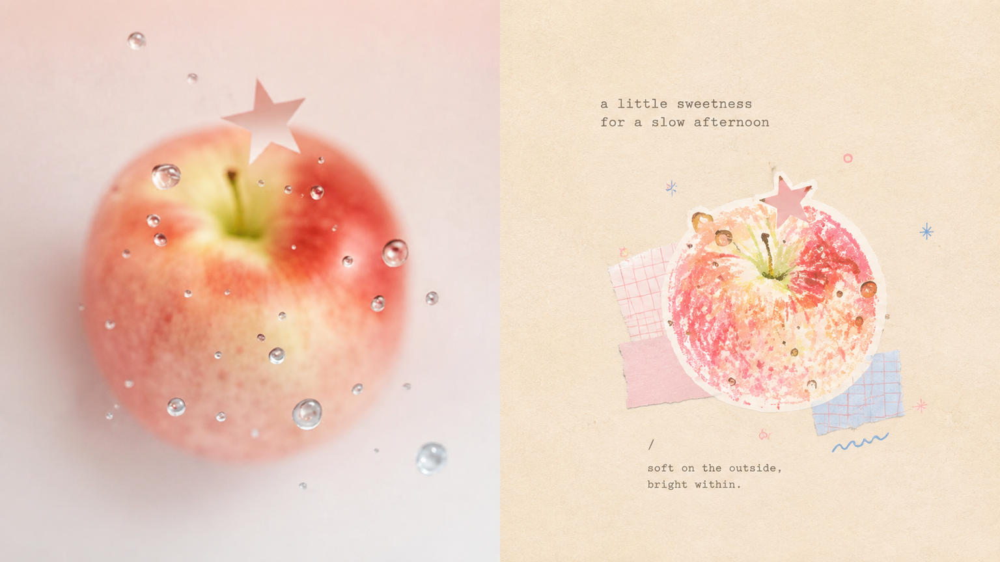
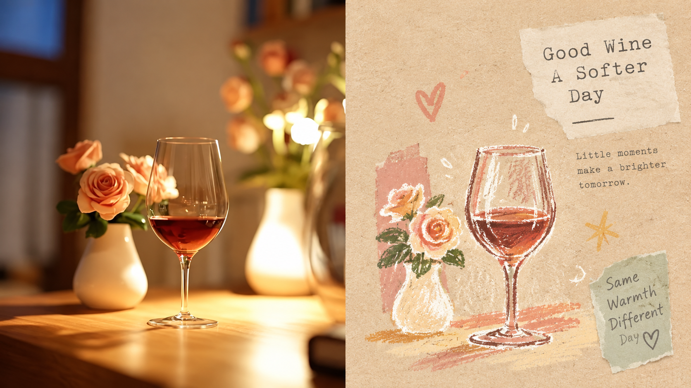
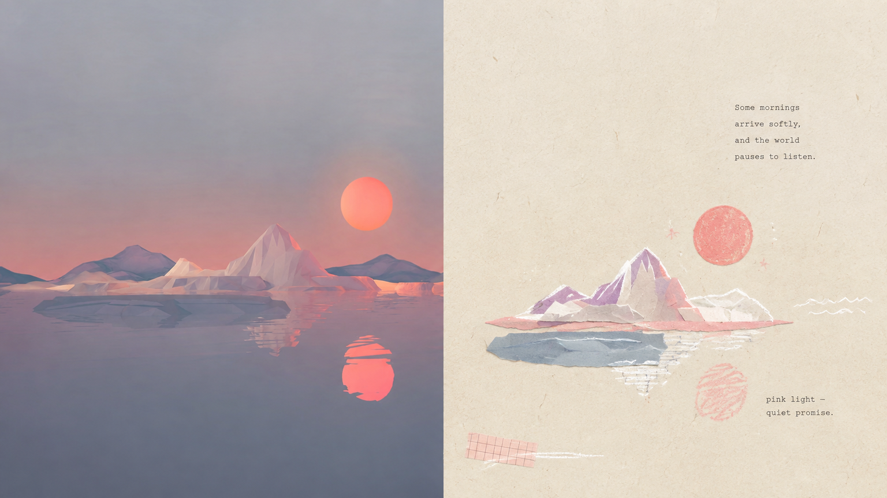
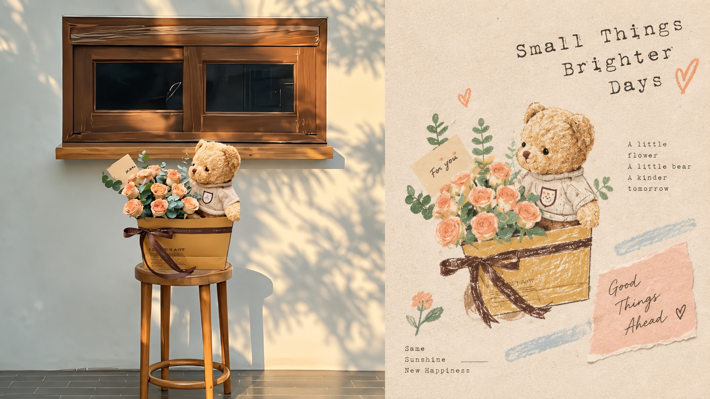
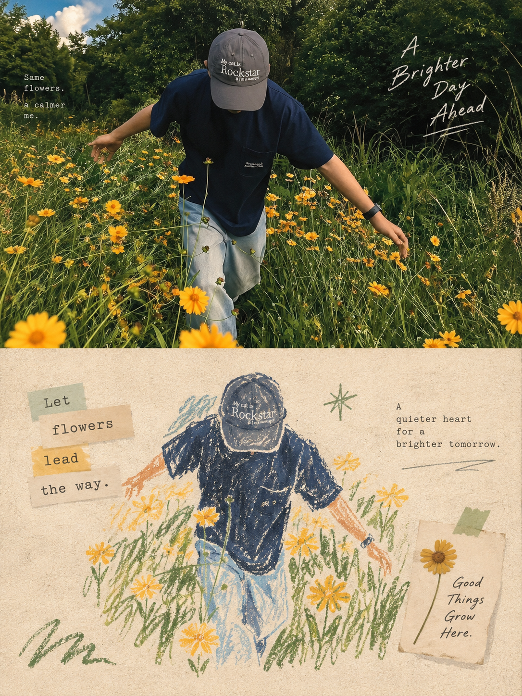
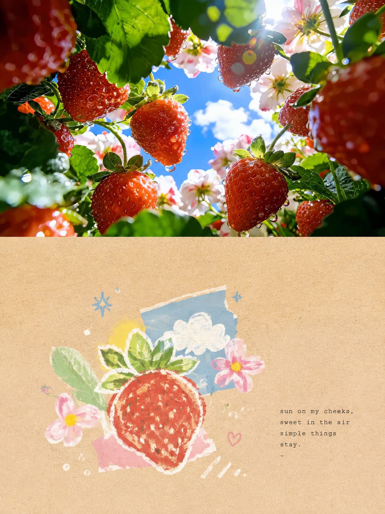
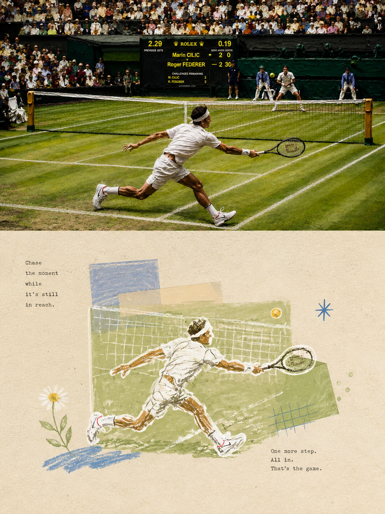
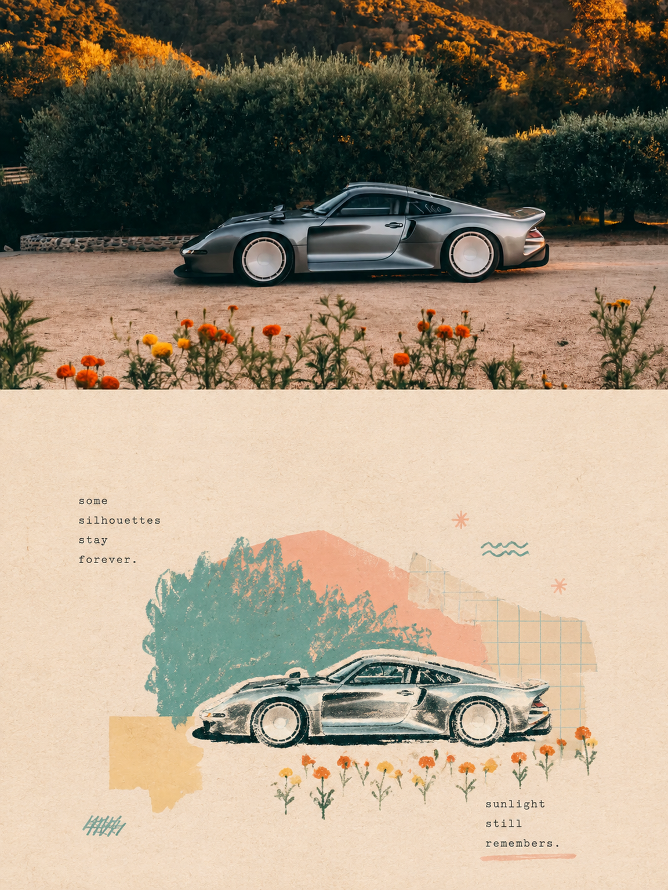

<div align="center">

# XXD Panel 115｜パステル印章コラージュ帖

写真の核となる記憶を、古紙の上のパステル手描き印章コラージュへ再構成する

<a href="README.md">简体中文</a> · <a href="README.en.md">English</a> · <strong>日本語</strong> · <a href="README.ko.md">한국어</a> · <a href="README.ar.md">العربية</a>

</div>

## 作例展示

**16:9 横長・左右構成（左が元写真、右がデザイン、厳密な 50:50）**

| sample-05 | sample-06 |
|---|---|
|  |  |
|  |  |

**3:4 縦長・上下構成（上が元写真、下がデザイン、厳密な 50:50）**

| sample-09 | sample-10 |
|---|---|
|  |  |
|  |  |

上の8点は異なるオリジナル参考画像を使用し、Panel 115 が自身の原文プロンプトから1点ずつ独立して単一パスで生成しました。別番号の作品や中間結果は流用していません。すべての作例から AI 生成・来歴メタデータを削除済みです。

## 適した場面と解決すること

写真をポスター、表紙、SNS、展示画像へ再設計するとき、全てを逐物描写したり画面を埋めたり、甘い子ども向けコラージュの型を当てたりして、元の関係と呼吸を失いがちです。

**Panel 115** は写真一枚を独立した 3:4 縦長ポスターにします。上半分は写真の現実を保ち、下半分は記憶に残るテーマ、関係、構造の流れ、感情、視覚的比喩を、古紙の質感を持つパステル手描き素材コラージュへ翻訳します。小さな印章の主役、意識的な余白、元写真から選ぶ2〜4色、控えめな軽い文字が、巧みで軽やかな再表現をつくります。

## 原文プロンプト・5言語

[简体中文](references/original-prompt/zh-CN.md) · [English](references/original-prompt/en.md) · [日本語](references/original-prompt/ja.md) · [한국어](references/original-prompt/ko.md) · [العربية](references/original-prompt/ar.md)

中国語ファイルはユーザーの原文を一字一句保存した唯一の創作・美的基準です。他の4ファイルは忠実な全文訳で、生成プロンプトを書き換えません。

**キーワード：** 3:4 厳密 50:50 · 古紙テクスチャ · パステルクレヨン落書き · 素材コラージュ · 小さな印章主体 · 元写真由来2〜4色 · 意識的な余白 · 軽いタイプ文字

## Panel 115 が向いているか

| 必要なこと | このスタイルの答え |
|---|---|
| フィルターではない上下比較ポスター | 上に現実写真、下に紙とパステルの再構成を各50%で配置。 |
| 混雑さを抑えた認識可能な主体 | 輪郭、姿勢、方向、関係を絞り、小さな印章と大きな余白で構成。 |
| 安価なキャンディ色ではない柔らかな色 | 写真から2〜4色を選び、明るく温かなパステルへ再調整。 |

## 写真から完成品まで

```text
上半分の現実写真を保存 → 主題・関係・構造・感情・比喩を理解 → 不要な細部を削除 → 小さな印章状主体へ再構成 → パステル線と少量の紙片で表現 → 元写真から2〜4色を選ぶ → 意識的な余白と極少量の文字を構成
```

## 能力と境界

各写真を独立生成し、複数写真や中間生成物、作例、別 Panel の結果を再変換しません。標準は3:4縦長・上下厳密50:50で、`left-right`、`design-only`、`wallpaper-pack` にも対応します。ディレクトリ入力は安定順で一覧化し、設定を一度解決して、PNGを一つの新しいタスクディレクトリへ出力します。

## 文字と言語

`prompt` は原文に従って少量の文を導き、`exact` は今回の文言を一字一句保持し、`none` は文字・数字・Logo・擬似文字を禁止します。対象言語を明示し、ファイル名から推測しません。

## 使い方

```bash
git clone https://github.com/nevertoday/xxd-panel-115.git
mkdir -p ~/.codex/skills
ln -s "$(pwd)/xxd-panel-115" ~/.codex/skills/xxd-panel-115
```

または：

```bash
npx skills add https://github.com/nevertoday/xxd-panel-115 --skill xxd-panel-115
```

ユーザー単位の Codex には `--global --agent codex --yes` を追加し、Agent セッションを再起動して `$xxd-panel-115` を呼び出します。

<!-- xxd-readme-ads:start -->
## XXD について

XXD は Xiaoxiaodong のブランド名略称です。作成・管理： [@xiaoxiaodong01](https://x.com/xiaoxiaodong01).

## サポートとメンバーシップ

> **広告表示：** このセクションのQRコードおよび有料会員・サービスのリンクはXXDのプロモーション情報です。スキャンや購入は任意であり、オープンソースの利用には影響しません。

### Xiaoxiaodong 総控 · 将軍総指揮 Skill · CNY 100

CNY 100 の一回払いで、このシリーズの将軍総指揮 Skill（`xxd-panel-all`）を利用できます。全兵士 Skills の統括、推薦、指名派遣、一括調整に対応します。WeChat では「将軍総指揮 Skill」と記載してください。

<!-- xxd-panel-command-system:start -->
**購入後に利用可能：全隊を指揮する「将軍 Skill」**

| 階級 | Skill | 担当 |
|---|---|---|
| **将軍級** | [`xxd-panel-all`](https://github.com/xiaoxiaodong-ai/xxd-panel-all) | 利用可能な番号付き Skills の検出、画像・テーマ・用途からの推薦、番号指定の派遣、同一素材の複数スタイル試作、フォルダー画像の一括割り当てと個別派遣。 |
| **兵士級** | `xxd-panel-NNN` | 各番号が固有の原文プロンプトと美学だけを実行し、将軍から渡された一つの仕事を完成させます。 |

将軍 Skill は、番号付き Skills 全隊の司令塔です。購入後すぐに利用でき、インストール、更新、編成、派遣方法についてサポートを受けられます。将軍は整理と派遣だけを担当し、兵士の原文美学を改変・混合・上書きしません。各完成作品は、選ばれた兵士 Skill が独立して制作します。
<!-- xxd-panel-command-system:end -->

### 知識星球＋会員プロンプトライブラリ＋全将軍 Skills 会員 · 年額 CNY 699

[知識星球](https://wx.zsxq.com/group/15554814142882)、[XXD 会員プロンプトライブラリ](https://vip.xiaoxiaodong.ai/)、全将軍 Skills 会員は同じ会員権です。**一度の年額決済で3つの特典をすべて利用でき、二重の購入は不要です。**

[Knowledge Planet](https://wx.zsxq.com/group/15554814142882) · [Member Prompt Library](https://vip.xiaoxiaodong.ai/)

<p align="center"><a href="https://xiaoxiaodong.pages.dev/assets/wechat-qr.png"></a></p>

---

<div align="center">

## ☕ オープンソースを支援

このプロジェクトが役に立ったら、Buy Me a Coffee から任意で応援していただけます。

<p align="center"><a href="https://github.com/nevertoday/zhongguo-traditional-colors/blob/main/docs/images/buy-me-a-coffee-qr.png?raw=true"></a></p>

</div>
<!-- xxd-readme-ads:end -->

## ライセンス

本プロジェクト（Skill、プロンプト、スクリプト、文書、付属サンプル画像を含む）は **PolyForm Noncommercial License 1.0.0** の下で提供されます。完全な法的条文は [LICENSE](LICENSE)、公式ページは <https://polyformproject.org/licenses/noncommercial/1.0.0> を参照してください。

分かりやすく言うと：

- 個人は学習、研究、実験、テスト、趣味のプロジェクト、私的娯楽に使用できます。慈善団体、教育機関、公的研究・安全・保健機関、環境保護団体、政府機関も使用できます。
- **非商業目的**であれば、使用、複製、変更、派生物の作成、共有が可能です。共有時には本ライセンス（または上記リンク）と、作者が示したすべての `Required Notice:` 文を添付する必要があります。
- 商用製品・サービス、有料納品、アクセス権やライセンスの販売、商業利用につながることが予想される用途には使用できません。商用利用には著作権者から別途書面による許可を得てください。
- 本契約が付与するのは明記された著作権ライセンスと限定的な特許ライセンスだけです。商標、ブランド名、その他明記されていない権利は付与されず、ライセンスを第三者へ再許諾することもできません。
- 書面で違反通知を受けた場合、32 日以内に遵守状態へ戻り、実際の是正措置を取らなければライセンスは直ちに終了します。特許侵害を書面で主張した場合も特許ライセンスが終了します。
- 内容は法律が認める範囲で「現状のまま」提供され、保証はありません。利用に伴うリスクと損失は利用者が負います。
